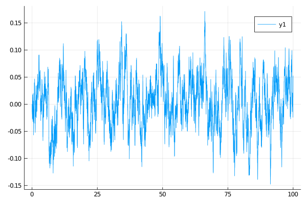

# [Installation](@id get_started)
The package is not registered yet. To install it write:
```julia
] add https://github.com/JuliaDiffusionBayes/DiffusionDefinition.jl
```

## Defining the process
To define a diffusion law use a macro `@diffusion_definition`:
```julia
using DiffusionDefinition
const DD = DiffusionDefinition

@diffusion_process OrnsteinUhlenbeck begin
    # :dimensions is optional, defaults both process and wiener to 1 anyway
    :dimensions
    process --> 1
    wiener --> 1

    :parameters
    (θ, μ, σ) --> Float64
end
```
This will define a struct `OrnsteinUhlenbeck` and announce to Julia that it represents a one-dimensional diffusion process driven by a one-dimensional Brownian motion and that it depends on 3 parameters of type `Float64` each.

To complete characterization of a diffusion law we define the drift and diffusion coefficients:
```julia
DD.b(t, x, P::OrnsteinUhlenbeck) = P.θ*(P.μ - x)
DD.σ(t, x, P::OrnsteinUhlenbeck) = P.σ
```
We will also specify a default datatype for convenient definition of trajectories
```julia
DD.default_type(::OrnsteinUhlenbeck) = Float64
DD.default_wiener_type(::OrnsteinUhlenbeck) = Float64
```

## Sampling trajectories under the diffusion law
Use the function `rand` to sample the process
```julia
tt, y1 = 0.0:0.01:100.0, 0.0
P = OrnsteinUhlenbeck(2.0, 0.0, 0.1)
X = rand(P, tt, y1)
```

## Plotting the process
Plotting may be done with any supported backend via function `plot`. Plotting recipes are provided which make sure that the output of `rand` (of the datatype `trajectory`) is understood by `plot`. For instance, to plot all diffusion coordinates (in case above only one) against the time variable write
```julia
using Plots
gr()
plot(X, Val(:vs_time))
```


## Repeated sampling
The package is implemented with the setting of Markov chain Monte Carlo methods in mind. Consequently, methods are built to be as efficient as possible under the setting of repeated sampling of trajectories. To fully leverage this speed you need to pre-allocate the containers for trajectories:
```julia
X, W = trajectory(tt, P)
```
and then sample the process by:
1. drawing the driving Brownian motion `W`,
2. and then, `solve!`ing the path `X` from the Wiener path `W`
```julia
Wnr = Wiener()
rand!(Wnr, W)
DD.solve!(X, W, P, x0)
```
Sampling trajectories multiple times becomes very efficient then, for instance:
```julia
julia> using BenchmarkTools
julia> @btime begin
           for _ in 1:10^4
               rand!(Wnr, W)
               DD.solve!(X, W, P, x0)
           end
       end
  1.840 s (10000 allocations: 156.25 KiB)
```
i.e. `2`s to sample `10 000` trajectories, each revealed on a time-grid with `10 001` points (tested on an Intel(R) Core(TM) i7-4600U CPU @ 2.10GHz). Note that sampling does only one allocation per call (which is due to return of a value by `solve!`).
