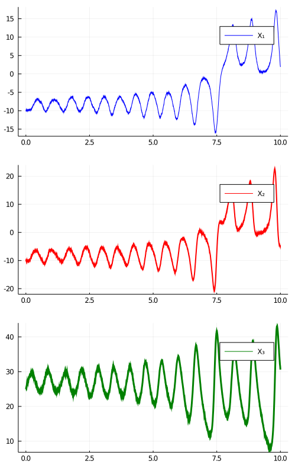

# How to customize plots of diffusion trajectories?
***
Underneath a call to
```julia
X = ... # sampled trajectory
plot(X, Val(:x_vs_y))
# or
plot(X, Val(:vs_time))
```
Julia looks up the relevant plotting recipes implemented in [DiffusionDefinition.jl](https://juliadiffusionbayes.github.io/DiffusionDefinition.jl/dev/) in order to understand how the `plot` function should handle the object
```julia
X::Trajectory
```

However, in any other capacity, the called `plot` function behaves in an exactly the same way as if arrays with data were passed for plotting. In particular, you can pass additional named arguments as you would to a regular call to a `plot` function and change the plotting backend to anything supported by `Julia`.

## Example
----
For instance, using the law of the Lorenz–63 system we can decorate our plots as follows:
```julia
# change the backend if you want to
gr()

# plot
plot(
    X, Val(:vs_time);
    layout=(3, 1),
    size=(500, 800),
    label=["X₁" "X₂" "X₃"],
    color=["blue" "red" "green"],
    linewidth=[1 2 3]
)
```

