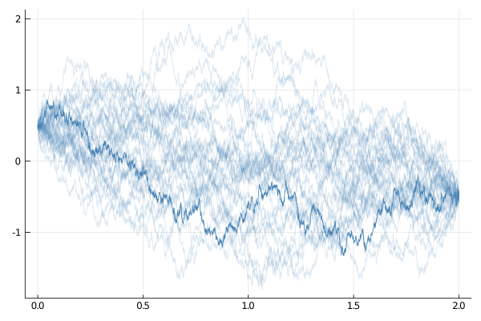
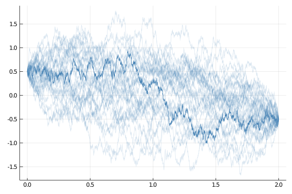

# [How to sample Brownian bridges?](@id how_to_guides)
Brownian bridge is a Brownian motion conditioned to hit a pre-specified end-point.

## Approximate bridges
One way to sample Brownian bridges relies on an unconditioned SDE that describes the dynamics of a Brownian bridge (conditioned to hit $$x_T\in\RR^d$$).
```math
\dd X_t = \frac{x_T-X_t}{T-t}\dd t + \dd W_t,\qquad X_0=x_0\qquad t\in[0,T].
```
Define a diffusion with such a drift and then sample from it:
```julia
using DiffusionDefinition, Plots
const DD = DiffusionDefinition

@diffusion_process BBApprox begin
    :auxiliary_info
    T --> Float64
    xT --> Float64
end

DD.b(t, x, P::BBApprox) = (P.xT - x)/(P.T-t)
DD.σ(t, x, P::BBApprox) = 1.0

DD.default_type(::BBApprox) = Float64
DD.default_wiener_type(::BBApprox) = Float64

xT, T = -0.5, 2.0
P = BBApprox(T, xT)
tt, x0 = 0.0:0.001:T, 0.5
X = rand(P, tt, x0)

plot_kwargs = (color="steelblue", label="")
p = plot(X; plot_kwargs...)
for i in 1:30
    plot!(p, rand(P, tt, x0); alpha=0.2, plot_kwargs...)
end
display(p)
```


!!! note
    Bridges above rely on the Euler–Maruyama scheme and are thus burdened with an approximation error. To sample Brownian bridges devoid of any errors (without sacrificing any performance) use the method below.

## Exact bridges
A preferred way of sampling Brownian bridges relies on a second identity that connects distributions of
1. `W`—a Brownian motion on $$[0,T]$$ started from $$0$$, and
2. `B`—a Brownian bridge on $$[0,T]$$ connecting $$x_0$$ and $$x_T$$:

```math
\left\{
    x_0 + W_t + \frac{t}{T}\left( x_T-x_0-W_T \right); t\in[0,T]
\right\} \overset{d}{=} B.
```

```julia
B = trajectory(tt, Float64)
W = rand(Wiener(), tt, 0.0)
B.x .= x0 .+ W.x .+ tt./T.*(xT .- x0 .- W.x[end])

p = plot(B; plot_kwargs...)
for i in 1:30
    W = rand(Wiener(), tt, 0.0)
    B.x .= x0 .+ W.x .+ tt./T.*(xT .- x0 .- W.x[end])
    plot!(p, B; alpha=0.2, plot_kwargs...)
end
display(p)
```


!!! tip
    Both method apply to sampling of multidimensional Brownian bridges as well!
