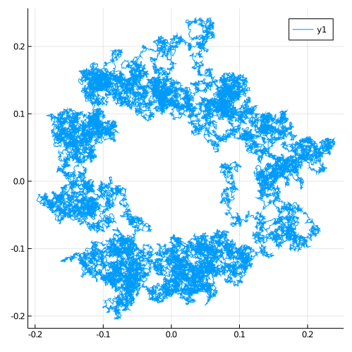

# How to sample complex-valued diffusions?
From the perspective of internal mechanics of the package there is nothing special about complex valued processes. You simply need to make sure that you define the process with appropriate datatype, say `ComplexF64`.

## Example
The logo of this package was sampled using a complex-valued diffusion that has a mean reversion term that attracts the process towards a point that zooms around a unit circle on a complex plane:
```julia
using DiffusionDefinition
const DD = DiffusionDefinition
using Random, Plots

@diffusion_process CustomComplexOU begin
    :parameters
    (θ, μ, σ) --> ComplexF64
end

DD.b(t, x, P::CustomComplexOU) = P.θ*(P.μ*exp(im*t) - x)
DD.σ(t, x, P::CustomComplexOU) = P.σ

DD.default_type(::CustomComplexOU) = ComplexF64
DD.default_wiener_type(::CustomComplexOU) = ComplexF64

Random.seed!(10)
θ = ComplexF64.([10.0, 0.15, 0.2])
P = CustomComplexOU(θ...)
tt, x0 = 0.0:0.0001:2π, ComplexF64(θ[2])
X = rand(P, tt, x0)
plot(map(x->real(x), X.x), map(x->imag(x), X.x), size=(500, 500))
```

