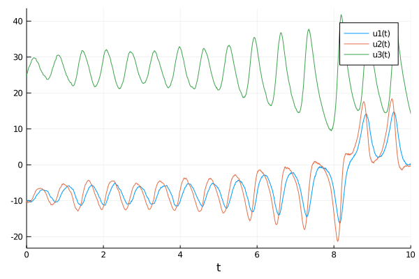

# How to use higher order SDE solvers for simulating trajectories?
----
When you call functions `rand` or `rand!` on instantiated diffusion laws, then by default DiffusionDefinition.jl uses the Euler–Maruyama solvers to find the trajectory from the simulated Wiener process. **No other solvers are implemented in the package DiffusionDefinition.jl**. The reason behind this lies at the core of why DiffusionDefinition.jl exists.

> DiffusionDefinition.jl has been created to provide an intuitive way of defining diffusion processes for an application to Bayesian inference for diffusion processes with the use of Guided Proposals. For this application it is necessary to be able to go between the driving Brownian motion `W` and the simulated trajectory `X` back and forth. Custom Euler–Maruyama solvers implemented in DiffusionDefinition.jl are a simple and effective solution for this particular use case. Had we not cared about having a handle on going between `W` and `X` we would have simply used a mature and extensive package [DifferentialEquations.jl](https://github.com/SciML/DifferentialEquations.jl) and made use of a full range of SDE solvers.

!!! note
    Higher-order solvers might be implemented in the future (ideally, we would simply offload the problem of sampling the process to [DifferentialEquations.jl](https://github.com/SciML/DifferentialEquations.jl)). For the time being this does not feature on a TODO list.

Of course, for other applications having access to high order solvers might be beneficial. In that case you should simply use the package [DifferentialEquations.jl](https://github.com/SciML/DifferentialEquations.jl) and pass your instantiated model as a parameter. For instance:
```julia
using DifferentialEquations
using StaticArrays, Plots

using DiffusionDefinition
const DD = DiffusionDefinition

@load_diffusion Lorenz
θ = [10.0, 28.0, 8.0/3.0, 1.0]
P = Lorenz(θ...)

# define the drift:
f(u,p,t) = DD.b(t, u, P)

# and volatility, in this case it's diagonal, follow DifferentialEquations.jl convention
g(u,p,t) = DD.σ(t, u, P).diag

tspan = (0.0, 10.0)
u0 = @SVector [-10.0, -10.0, 25.0]

# simulate a trajectory using DifferentialEquations.jl
prob = SDEProblem(f, g, u0, tspan, P)
sol = solve(prob, SRIW1() #= choose a solver =#, adaptive=true)

plot(sol)
```

