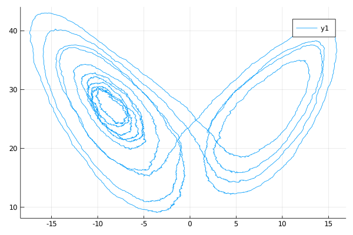
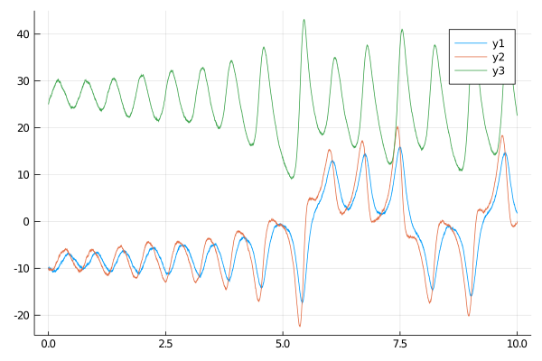

# Sampling diffusion trajectories
--------------------------------------------------------------------------------
This package extends functions `Random.rand!` and `Base.rand` to sampling of trajectories of diffusion processes.

## Trajectories
The containers for sampled trajectories are instances of `Trajectory` from the package [Trajectories.jl](https://github.com/mschauer/Trajectories.jl). The functions exported by `Trajectories.jl` are re-exported by this package. The most literal way of defining trajectories is to directly pass already initialized and sized containers (or iterators), for instance
```julia
tt = 0.0:0.01:1.0
xx = [zeros(Float64, 10) for _ in tt]
path = trajectory(tt, xx)
```
However, we may also be more concise and let `trajectory` initialize the path containers for us:
```julia
# for mutable types we need to pass DataType as well as dimension
path_mutable = trajectory(tt, Vector{Float64}, 10)
# for immutable types the dimension is inferred from the DataType
path_mutable = trajectory(tt, SVector{10,Float64})
```
Finally, if we are initializing containers for a specific diffusion, then we may utilize the [default types](@ref default_types_for_P) defined for this law together with information about diffusion's dimensions. For instance:
```julia
P = Lorenz(10.0, 28.0, 8.0/3.0, 1.0)
paths = trajectory(tt, P)
XX, WW = paths.process, paths.wiener
```
Or optionally specify the types ourselves:
```julia
P = Lorenz(10.0, 28.0, 8.0/3.0, 1.0)
paths = trajectory(
    tt,
    P,
    Vector{Float64}, # process DataType
    Vector{Float64}, # Wiener DataType
)
X, W = paths.process, paths.wiener
```
!!! note
    You can also define multiple trajectories at once by passing multiple time segments, for instance

    ```julia
    dt = 0.01
    paths = trajectory([0.0:dt:1.0, 1.0:dt:2.0, 2.0:dt:3.0], P)
    # XX below contains three trajectories and so does WW
    XX, WW = paths.process, paths.wiener
    ```

!!! tip
    If you need to call diffusion samplers multiple times (because you are using them, say, in an MCMC setting), then initializing trajectories once and passing them around to sampling functions will massively improve the overall performance of your algorithms. However, if all you want to do is sample the trajectory once or a couple of times, then you don't need to worry about initializing trajectories yourself and let it be done by the `rand` function.

The time vector and path vector can be inspected by accessing fields `t` and `x` respectively:
```julia
_time, _path = XX.t, XX.x
```
See the [README.md of Trajectories](https://github.com/mschauer/Trajectories.jl) for more details regarding other functionality implemented for `Trajectory`'ies.

## Sampling Wiener process
In this package sampling of diffusion paths is always done on the basis of sampling the Wiener process first, treating it as a driving Brownian motion and then `solve!`ing the trajectory of the process based on that. The simplest way of sampling a Wiener process is to call:
```julia
y1 = ... # define a starting point
W = rand(Wiener(), tt, y1)
```
The dimensions and DataType of the Wiener process's trajectory are going to be inferred from the starting point `y1`.

Most often however, we need to sample the **standard** Brownian motion. For that reason we may omit `y1` and it will be initialized to `zero`. In this case `rand` will use information contained in the struct `Wiener` to infer the dimension and DataType, for instance:
```julia
W = rand(Wiener(4, ComplexF64), tt)
```
to sample a four-dimensional complex-valued Brownian motion (with `Float64` complex numbers).

!!! warning
    If `y1` is not specified the DataType of state space will be set to `SVector` by default. To change this default behaviour you must overwrite the `zero` function to:

    ```julia
    Base.zero(w::Wiener{D,T}) where {D,T} = zeros(T, D)
    ```

    say, to use `Vector`s instead.

Alternatively, to avoid implicit allocation of space by `rand` we may pass a pre-initialized `Trajectory` to `rand!`:
```julia
rand!(Wiener(), W)
# OR
rand!(wiener(), W, y1) # The first letter in `Wiener()` may be capital or not
```
Note that in this case there is no need to decorate `Wiener` with additional type and dimension information as it is automatically inferred from the `Trajectory` container.

## Sampling diffusion processes
The simplest way of sampling a diffusion trajectory is to call:
```julia
P = Lorenz(10.0, 28.0, 8.0/3.0, 1.0)
y1 = ... # define a starting point
tt = 0.0:0.001:10.0
X = rand(P, tt, y1)
```
The type used for states is going to be inferred from the starting point and the dimensions of the Wiener and diffusion processes will be inferred from `P`. The decision about in-place vs out-of-place computation will be made based on the inferred type.
!!! note
    `y1` can also be left unspecified, then, the trajectory will start from `zero` and the default diffusion type of `P` will be used. Nonetheless, for many diffusion laws starting from `zero` might not make much sense, so this use is discouraged.

`rand` for diffusions is a convenience function that wraps:
- initialization of trajectories `X` and `W` for the diffusion and Wiener paths respectively
- sampling Wiener path `W`
- `solve!`ing the path `X` from the driving Brownian motion based on the Euler-Maruyama scheme.

If you care about performance issues—say `X` needs to be re-sampled multiple times—then you might want to perform these steps by hand. I.e.
```julia
# initialize containers:
X, W = trajectory(tt, P)
y1 = @SVector [-10.0, -10.0, 25.0]
# sample Wiener path:
rand!(Wiener(), W)
# solve for the process trajectory
DD.solve!(X, W, P, y1) # additionally pass `buffer` for in-place computations
```
Calling `rand!` and `DD.solve!` over and over again is much quicker than calling `rand` multiple times.

!!! tip
    `rand` and `rand!` functions by default use the default pseudo-random number generator from the package [Random.jl](https://docs.julialang.org/en/v1/stdlib/Random/). If you wish to use your own pseudo-random number generator then pass it as an additional first argument, for instance: `rand(RNG, Wiener(), tt)`.

## Plotting the results
We provide plotting recipes for the `Trajectory` objects, so the `plot` function can be used to visualize the sampled trajectories very easily. Pass `Val(:vs_time)` to plot multiple (or single) trajectories vs time variable. Pass `Val(:x_vs_y)` to plot two coordinates against each other. Specify coordinates with a named argument `coords`. Otherwise, decorate your plots as you would otherwise by calling a `plot` function. For instance, to plot `X[1]` against `X[3]` call:
```julia
using Plots
plot(X, Val(:x_vs_y); coords=[1,3])
```


To plot all coordinates against time call:
```julia
plot(X, Val(:vs_time))
```

