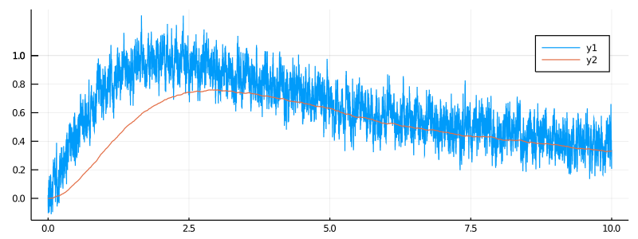

# Favetto-Samson compartment model
Two dimensional SDE:
```math
\begin{split}
\dd X_t &= (αδ(t) - (α+β)X_t + μ Y_t)\dd t + σ_1 dW^{[1]}_t,\\
\dd Y_t &= (λX_t - μ Y_t) \dd t + σ2 dW^{[2]}_t.
\end{split}
```

Can be imported with
```julia
@load_diffusion FavettoSamson
```

#### Example
```julia
using DiffusionDefinition
using StaticArrays, Plots

@load_diffusion FavettoSamson
θ = [117, 5.83, 1.25, 1.5, 1.41, 0.0]
P = FavettoSamson(θ..., t->2*(t/2)/(1+(t/2)^2))
tt, y1 = 0.0:0.0001:10.0, @SVector [0.0, 0.0]
X = rand(P, tt, y1)
plot(X, Val(:vs_time), size=(800, 300))
```

