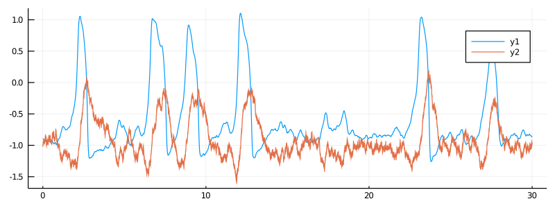
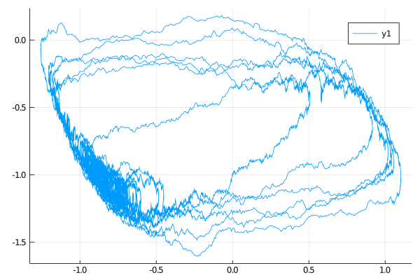
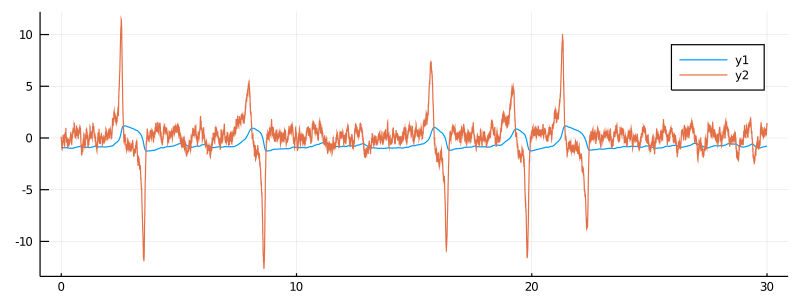
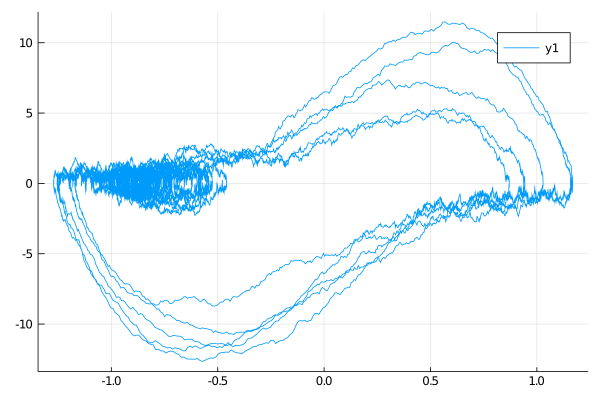
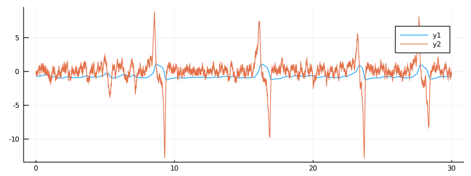
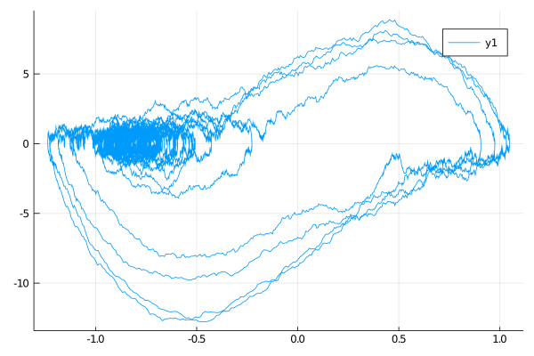

# FitzHugh-Nagumo model
A model developed to mimic the evolution of a neuron's membrane potential. Originally, it has been developed as a modification to the Van der Pol oscillator.

Three parametrisations of the process are provided in this package.
### Regular
Defined simply as `FitzHughNagumo` is a solution `(Y,X)` to the following stochastic differential equation:
```math
\begin{align*}
\dd Y_t &= \frac{1}{\epsilon}\left( Y_t - Y_t^3-X_t + s \right )\dd t,\\
\dd X_t &= \left( \gamma Y_t - X_t + \beta \right )\dd t + \sigma \dd W_t.
\end{align*}
```
It can be called with
```julia
@load_diffusion :FitzHughNagumo
```

#### Example
```julia
using DiffusionDefinition
using StaticArrays, Plots

@load_diffusion FitzHughNagumo
θ = [0.1, -0.8, 1.5, 0.0, 0.3]
P = FitzHughNagumo(θ...)
tt, y1 = 0.0:0.001:30.0, @SVector [-0.9, -1.0]
X = rand(P, tt, y1)
plot(X, Val(:vs_time), size=(800, 300))
```


```julia
plot(X, Val(:x_vs_y))
```



### Alternative
The stochastic differential equation above is re-parametrized in such a way that the first coordinate is given by the integrated second coordinate:

```math
\begin{align*}
\dd Y_t &= \dot{Y}_t \dd t,\\
\dd\dot{Y}_t &= \frac{1}{\epsilon}\left( (1-\gamma)Y_t -Y_t^3 -\epsilon \dot{Y}_t + s - \beta + \left( 1-3Y_t^2 \right)\dot{Y}_t \right)\dd t + \frac{\sigma}{\epsilon}\dd W_t.
\end{align*}
```
The process (with name `FitzHughNagumoAlt`) can be called with
```julia
@load_diffusion :FitzHughNagumoAlt
```
#### Example
A parameterization equivalent to the above is then given by:
```julia
using DiffusionDefinition
using StaticArrays, Plots

@load_diffusion FitzHughNagumoAlt
θ = [0.1, -0.8, 1.5, 0.0, 0.3]
P = FitzHughNagumoAlt(θ...)
tt, y1 = 0.0:0.001:30.0, @SVector [-0.9, 0.0]
X = rand(P, tt, y1)
plot(X, Val(:vs_time), size=(800, 300))
```


```julia
plot(X, Val(:x_vs_y))
```



### [Conjugate](@id conjugate_fitzhugh_nagumo)
It is defined analogously to *alternative* parametrisation above, the only difference being that an additional step is taken of redefining the parameters:

```math
s\leftarrow \frac{s}{\epsilon},\quad \beta\leftarrow\frac{\beta}{\epsilon},\quad \sigma\leftarrow\frac{\sigma}{\epsilon},\quad \gamma\leftarrow\frac{\gamma}{\epsilon},\quad \epsilon\leftarrow\frac{1}{\epsilon}.
```

This results in the stochastic differential equation of the form:

```math
\begin{align*}
\dd Y_t &= \dot{Y}_t \dd t,\\
\dd\dot{Y}_t &= \left( (\epsilon-\gamma)Y_t -\epsilon Y_t^3 -\dot{Y}_t + s - \beta + \epsilon\left( 1-3Y_t^2 \right)\dot{Y}_t \right)\dd t + \sigma \dd W_t.
\end{align*}
```
The diffusion (with a struct name `FitzHughNagumoConjug`) can be called with
```julia
@load_diffusion :FitzHughNagumoConjug
```

#### Example
A parameterization equivalent to the above is then given by:
```julia
using DiffusionDefinition
using StaticArrays, Plots

@load_diffusion FitzHughNagumoConjug
θ = [10.0, -8.0, 15.0, 0.0, 3.0]
P = FitzHughNagumoConjug(θ...)
tt, y1 = 0.0:0.001:30.0, @SVector [-0.7, 0.0]
X = rand(P, tt, y1)
plot(X, Val(:vs_time), size=(800, 300))
```


```julia
plot(X, Val(:x_vs_y))
```



## Auxiliary diffusions (TODO the code won't execute correctly)
Additionally, we defined linear diffusions that can be taken as auxiliary processes in the setting of **Guided proposals**. For all of these definitions it is assumed that the target process is observed completely at discrete times. For other observation settings the auxiliary diffusions need to be defined by the user, but the definitions in this package may act as a guide on how to do it.

### For regular parametrisation
A linear diffusion obtained by linearising regular definition of the FitzHugh-Nagumo diffusion at an end-point:

```math
\begin{align*}
\dd \widetilde{Y}_t &= \frac{1}{\epsilon}\left( \left( 1-3y_T^2 \right )\widetilde{Y}_t - \widetilde{X}_t + s + 2y_T^3 \right)\dd t,\\
\dd\widetilde{X}_t &= \left( \gamma \widetilde{Y}_t - \widetilde{X}_t + \beta \right)\dd t + \sigma \dd W_t.
\end{align*}
```

It can be called with
```julia
@load_diffusion :FitzHughNagumoAux
```

### For alternative parametrisation
#### Simple
A pair: `(I,B)`, where `B` is a scaled Brownian motion and `I` is an integrated `B`:

```math
\begin{align*}
\dd I_t &= B_t\dd t,\\
\dd B_t &= \frac{\sigma}{\epsilon}\dd W_t.
\end{align*}
```
Can be called with
```julia
@load_diffusion :FitzHughNagumoAltAuxSimple
```

#### Linearisation at the end-point
A linear diffusion obtained by linearising alternative definition of the FitzHugh-Nagumo diffusion at an end-point. If only the first coordinate is observed the proposal takes a form:

```math
\begin{align*}
\dd\widetilde{Y}_t &= \widetilde{X}_t \dd t,\\
\dd\widetilde{X}_t &= \frac{1}{\epsilon}\left[ \left( 1-\gamma-3y_T^2 \right )\widetilde{Y}_t +\left( 1-\epsilon-3y_T^2 \right )\widetilde{X}_t + \left(2y_T^3+s-\beta \right )\right ]\dd t + \frac{\sigma}{\epsilon}\dd W_t.
\end{align*}
```

On the other hand, if both coordinates are observed, the proposal is given by:

```math
\begin{align*}
\dd\widetilde{Y}_t &= \widetilde{X}_t \dd t,\\
\dd\widetilde{X}_t &= \frac{1}{\epsilon}\left[ \left( 1-\gamma-3y_T^2 - 6y_T\dot{y}_T \right )\widetilde{Y}_t +\left( 1-\epsilon -3y_T^2 \right )\widetilde{X}_t + \left(2y_T^3+s-\beta + 6y_T^2\dot{y}_T \right )\right ]\dd t + \frac{\sigma}{\epsilon}\dd W_t.
\end{align*}
```
Can be called with
```julia
@load_diffusion :FitzHughNagumoAltAuxLin
```

### For conjugate parametrisation
#### Simple
A pair: `(I,B)`, where `B` is a scaled Brownian motion and `I` is an integrated `B`:

```math
\begin{align*}
\dd I_t &= B_t\dd t,\\
\dd B_t &= \sigma \dd W_t.
\end{align*}
```
Can be called with
```julia
@load_diffusion :FitzHughNagumoConjugAuxSimple
```

#### Linearisation at the end-point
It is defined analogously to `FitzHughNagumoAltAuxLin`, the only difference being that an additional step is taken of redefining the parameters (just as it was done in `FitzHughNagumoConjug` above). Consequently it is the solution to:

```math
\begin{align*}
\dd\widetilde{Y}_t &= \widetilde{X}_t \dd t,\\
\dd\widetilde{X}_t &= \left\{ \left[ \epsilon\left(1-3y_T^2 - 6y_T\dot{y}_T \right )-\gamma \right ]\widetilde{Y}_t +\left[ \epsilon\left( 1-3y_T^2 \right)-1 \right ]\widetilde{X}_t + \left[\epsilon\left(2y_T^3+ 6y_T^2\dot{y}_T \right ) +s-\beta \right]\right \}\dd t + \sigma \dd W_t,
\end{align*}
```
and can be called with
```julia
@load_diffusion :FitzHughNagumoConjugAuxLin
```
