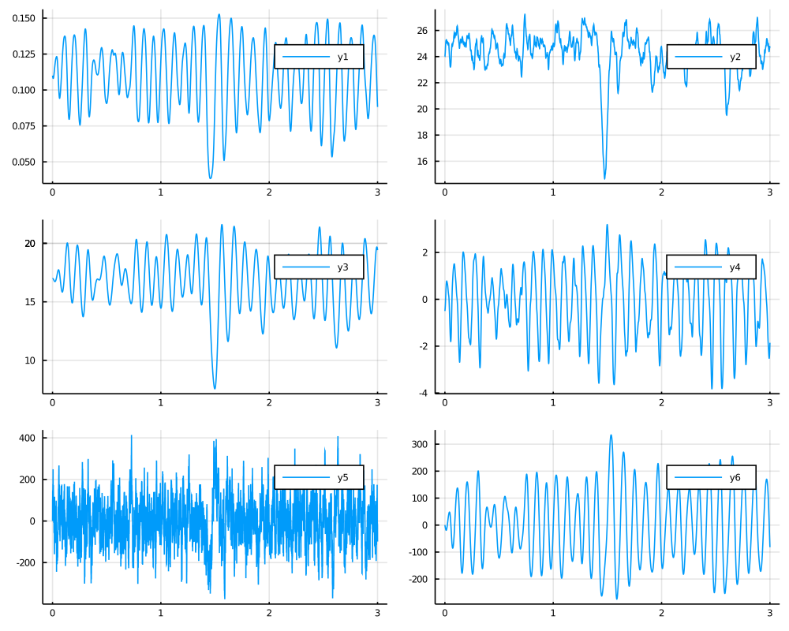

# Jansen-Rit model
Neural Mass Model used to describe the EEG data. It is a six-dimensional diffusion process driven by a three-dimensional Wiener process that is a solution to the following stochastic differential equation
```math
\begin{equation*}
    \begin{aligned}
        \dd X_t &= \dot X_t \dd t  \\
        \dd Y_t &= \dot Y_t \dd t  \\
        \dd Z_t &= \dot Z_t \dd t \\
        \dd \dot X_t &=   \left[A a \left(\mu_x(t) + \mbox{Sigm}(Y_t - Z_t)\right) - 2a \dot X_t - a^2 X_t\right] d t + \sigma_x \dd W^{(1)}_t\\
        \dd \dot Y_t &=  \left[A a \left(\mu_y(t) + C_2\mbox{Sigm}(C_1 X_t)\right) - 2a \dot Y_t - a^2 Y_t\right] d t + \sigma_y \dd W^{(2)}_t\\
        \dd \dot Z_t &=  \left[B b \left(\mu_z(t) + C_4\mbox{Sigm}(C_3 X_t)\right) - 2b \dot Z_t - b^2 Z_t\right] \dd t + \sigma_z \dd W^{(3)}_t,
    \end{aligned}
\end{equation*}
```
with initial condition
```math
(X_0,Y_0,Z_0, \dot X_0, \dot Y_0, \dot Z_0)=(x_0,y_0,z_0, \dot x_0, \dot y_0, \dot z_0) \in \RR^6
```
where
```math
\mbox{Sigm}(x) := \frac{\nu_{max}}{1 + e^{r(v_0 - x)}},
```
and
```math
\mu_x(t) :=\mu_x,\qquad \mu_y(t) :=\mu_y, \mu_z(t) :=\mu_z
```
and
```math
C_1 = C, \quad C_2 = 0.8C, \quad C_4 = C_3 = 0.25C.
```

Can be imported with
```julia
@load_diffusion JansenRit
```

#### Example
```julia
using DiffusionDefinition
using StaticArrays, Plots

@load_diffusion JansenRit
θ = [3.25, 100.0, 22.0, 50.0 , 135.0, 5.0, 6.0, 0.56, 0.0, 220.0, 0.0, 0.01, 2000.0, 1.0]
P = JansenRit(θ...)
tt, y1 = 0.0:0.0001:3.0, @SVector [0.11, 24, 17, -0.5, 0.0, 0.0]
X = rand(P, tt, y1)
plot(X, Val(:vs_time), layout=(3,2), size=(1000,800))
```

