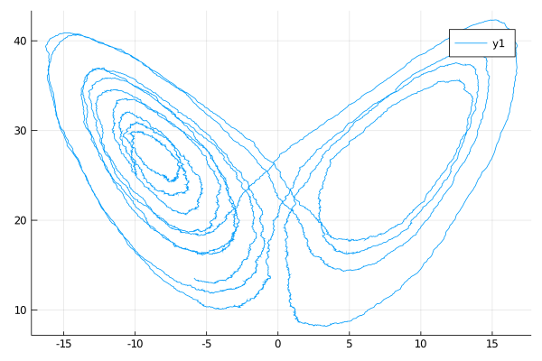

# Lorenz '63 system
Famous Lorenz attractor, a three-dimensional elliptic diffusion, a solution to the following stochastic differential equation
```math
\begin{align*}
\dd X_t &= \theta_1 (Y_t - X_t) \dd t + \sigma \dd W^{(1)}_t \\
\dd Y_t &= [X_t (\theta_2 - Z_t) - Y_t]\dd t + \sigma \dd W^{(2)}_t\\
\dd Z_t &= [X_t Y_t - \theta_3 Z_t]\dd t + \sigma \dd W^{(3)}_t.
\end{align*}
```
Can be imported with the following command
```julia
@load_diffusion :Lorenz
```
#### Example
```julia
using DiffusionDefinition
using StaticArrays, Plots

@load_diffusion Lorenz
θ = [10.0, 28.0, 8.0/3.0, 1.0]
P = Lorenz(θ...)
tt, y1 = 0.0:0.001:10.0, @SVector [-10.0, -10.0, 25.0]
X = rand(P, tt, y1)
plot(X, Val(:x_vs_y), coords=[1,3])
```


### Auxiliary diffusion
We additionally provide an implementation of a linear diffusion that can be used in a setting of **guided proposals**. It is defined as a solution to the following SDE:
```math
\begin{align}
\dd \wt{X}_t &= \left[-\theta_1 \wt{X}_t + \theta_2\wt{Y}_t\right]\dd t + \sigma \dd W^{(1)}_t,\\
\dd \wt{Y}_t &= \left[ (\theta_2-z_T)\wt{X}_t - \wt{Y}_t - x_T\wt{Z}_t + x_Tz_T \right]\dd t + \sigma \dd W^{(2)}_t,\\
\dd \wt{Z}_t &= \left[ y_T\wt{X}_t x_T\wt{X}_t -\theta_3\wt{Z}_t -x_Ty_T \right]\dd t + \sigma \dd W^{(3)}_t.
\end{align}
```
It can be called with
```julia
@load_diffusion :LorenzAux
```
#### Example
```julia
@load_diffusion LorenzAux
using DiffusionDefinition
using StaticArrays, Plots

@load_diffusion LorenzAux
θ = [10.0, 28.0, 8.0/3.0, 1.0]
t, T, vT = 0.0, 10.0, @SVector [-10.0, -10.0, 25.0]
P = LorenzAux(θ..., t, T, vT)
tt, y1 = t:0.001:T, vT
X = rand(P, tt, y1)
plot(X, Val(:x_vs_y), coords=[1,3])
```


!!! note
    Notice the limits of the axes! The auxiliary diffusion becomes an atrocious approximation to the Lorenz system over long time periods!
