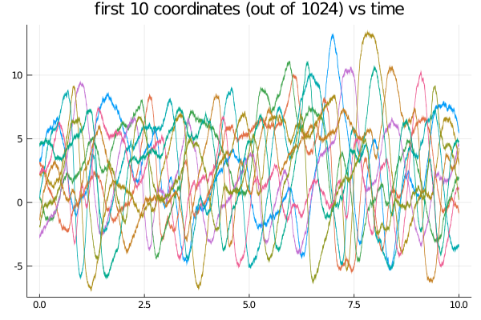

# Lorenz '96 system
A model of atmospheric convection where each coordinate of the $D$-dimensional process $X$ corresponds to a position on a periodic lattice that is supposed to be a proxy for a latitude circle on Earth. The diffusion $X$ is defined as a solution to the following system of SDEs:
```math
\dd X_t = \left[\left(X^{(i+1)}_t-X^{(i-2)}_t\right)X^{(i-1)}_t-X^{(i)}_t+F\right]\dd t + \sigma_i \dd W^{(i)}_t,\quad t\in[0,T],\quad X^{(i)}_0=x^{(i)}_0,
```
with $i\in\{1,\dots,D\}$ a cycling  index.
The process can be called with
```julia
@load_variable_diffusion :Lorenz96 D
```
where $D$ is a positive integer, indicating chosen dimension.

#### Example
```julia
@load_variable_diffusion Lorenz96 2^10
θ = [8.0, 1.0]
P = Lorenz96(θ...)
tt, y1 = 0.0:0.001:10.0, 9.0.*rand(SVector{2^10,Float64}).-3.0
X = rand(P, tt, y1)
plot(X, Val(:vs_time), coords=1:10, label="", title="first 10 coordinates (out of 1024) vs time")
```

!!! tip
    If you've done the steps above on your laptop as well, you will have noticed how slow the compilation of the code above took. The reason is that `StaticArrays` are not designed to work for vectors of size 100+. For this reason it is much better to use in-place versions of samplers. This can be done by changing the default types and then starting from an appropriately changed starting point.

    ```julia
    const DD = DiffusionDefinition
    DD.default_type(::Lorenz96) = Vector{Float64}
    DD.default_wiener_type(::Lorenz96) = Vector{Float64}
    y1 = 9.0.*rand(2^10).-3.0
    X = rand(P, tt, y1)
    ```
