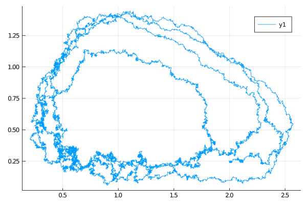
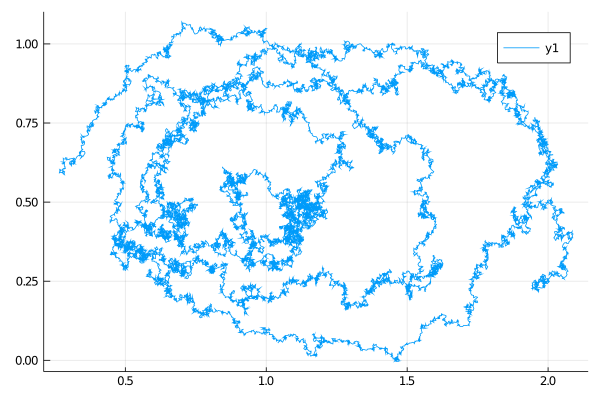

# [Lotka-Volterra](@id example_lotka_volterra)
A simple, scalar-valued predator-prey model.

```math
\begin{align*}
\dd X_t &= (\alpha X_t - \beta X_t Y_t) \dd t + \sigma_1 \dd W^{(1)}_t \\
\dd Y_t &= (\delta X_t Y_t -\gamma Y_t)\dd t + \sigma_2 \dd W^{(2)}_t.
\end{align*}
```
Can be called with
```julia
@load_diffusion LotkaVolterra
```

#### Example
```julia
using DiffusionDefinition
using StaticArrays, Plots

@load_diffusion LotkaVolterra
θ = [2.0/3.0, 4.0/3.0, 1.0, 1.0, 0.1, 0.1]
P = LotkaVolterra(θ...)
tt, y1 = 0.0:0.001:30.0, @SVector [2.0, 0.25]
X = rand(P, tt, y1)
plot(X, Val(:x_vs_y))
```


### Auxiliary diffusion
We also provide a linear diffusion that is obtained from linearizing SDE above at the equilibrium point. This process can be used as an auxiliary diffusion in the setting of **guided proposals**. It solves the following stochastic differential equation
```math
\begin{align*}
\dd \widetilde{X}_t &= \left(- \frac{\beta\gamma}{\delta} \widetilde{Y}_t + \frac{\gamma\alpha}{\delta}\right) \dd t + \sigma_1 \dd W^{(1)}_t \\
\dd \widetilde{Y}_t &= \left(\frac{\alpha\delta}{\beta} \widetilde{X}_t-\frac{\alpha\gamma}{\beta}\right)\dd t + \sigma_2 \dd W^{(2)}_t,
\end{align*}
```
and can be called with
```julia
@load_diffusion :LotkaVolterraAux
```

#### Example
```julia
using DiffusionDefinition
using StaticArrays, Plots

@load_diffusion LotkaVolterraAux
θ = [2.0/3.0, 4.0/3.0, 1.0, 1.0, 0.1, 0.1]
t, T, vT = 0.0, 1.0, nothing # dummy variables
P = LotkaVolterraAux(θ..., t, T, vT)
tt, y1 = 0.0:0.001:30.0, @SVector [2.0, 0.25]
X = rand(P, tt, y1)
plot(X, Val(:x_vs_y))
```


!!! note
    Note that we had to pass additional variables `t`, `T` and `vT` even though they are immaterial to the auxiliary law. The reason for this is that we defined `LotkaVolterraAux` in such a way that it is already fully compatible with [GuidedProposals.jl](https://github.com/JuliaDiffusionBayes/GuidedProposals.jl) and may be passed as an auxiliary law (and auxiliary laws currently require presence of fields `t`, `T` and `vT`). However, in practice, when dealing with `LotkaVolterraAux`, the internal states of `t`, `T` and `vT` are never used.
