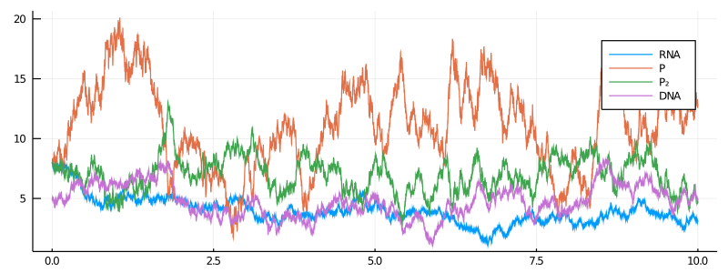

# Prokaryotic autoregulatory gene network
Chemical Langevin equation for a simple system describing production of a protein that is repressing its own production. The process under consideration is a $4$-dimensional diffusion driven by an $8$-dimensional Wiener process. The stochastic differential equation takes a form:
```math
 \dd X_t = S\left[\theta \circ h(X_t)\right]\dd t + S\odot \gamma(\theta\circ h(X_t)) \dd W_t,
```
where $\circ:\RR^d\to \RR^d$ is a component-wise multiplication:
```math
(\mu \circ \nu)_i = \mu_i\nu_i,\quad i=1,\dots,d,
```
the custom operation $\odot:\RR^{d\times d'}\to\RR^{d\times d'}$ is defined via:
```math
(M\odot \mu)_{i,j} = M_{i,j}\mu_j,\quad i=1,\dots,d;\, j=1,\dots,d',
```
the function $\gamma:\RR^d\to \RR^d$ is a component-wise square root:
```math
(\gamma(\mu))_i=\sqrt{\mu_i},\quad i=1,\dots,d,
```
 $S$ is the stoichiometry matrix:
```math
S=\left[
  \begin{matrix}
  0 & 0 & 1 & 0 & 0 & 0 & -1 & 0 \\
  0 & 0 & 0 & 1 & -2 & 2 & 0 & -1 \\
  -1 & 1 & 0 & 0 & 1 & -1 & 0 & 0 \\
  -1 & 1 & 0 & 0 & 0 & 0 & 0 & 0
  \end{matrix}
\right]
```
and the function $h$ is given by:
```math
h(x) = (x_3x_4, K-x_4, x_4, x_1, x_2(x_2-1)/2, x_3, x_1, x_2)^T
```
The chemical Langevin equation above has been derived as an approximation to a chemical reaction network
```math
\begin{align*}
&\mathcal{R}_1:\texttt{DNA} + \texttt{P}_2\rightarrow\texttt{DNA}\cdot\texttt{P}_2,
&\mathcal{R}_2:\texttt{DNA}\cdot\texttt{P}_2\rightarrow\texttt{DNA}+\texttt{P}_2\\
&\mathcal{R}_3:\texttt{DNA}\rightarrow\texttt{DNA}+\texttt{RNA},
&\mathcal{R}_4:\texttt{RNA}\rightarrow\texttt{RNA}+\texttt{P};\\
&\mathcal{R}_5:2\texttt{P}\rightarrow\texttt{P}_2,
&\mathcal{R}_6:\texttt{P}_2\rightarrow 2\texttt{P},\\
&\mathcal{R}_7:\texttt{RNA}\rightarrow\emptyset,
&\mathcal{R}_8\texttt{P}\rightarrow\emptyset,
\end{align*}
```
with reactant constants given by the vector $\theta$.

Can be imported with
```julia
@load_diffusion Prokaryote
```
#### Example

```julia
using DiffusionDefinition
using StaticArrays, Plots

@load_diffusion Prokaryote
θ, K = [0.1, 0.7, 0.35, 0.2, 0.1, 0.9, 0.3, 0.1], 10.0
P = Prokaryote(θ..., K)
tt, y1 = 0.0:0.001:10.0, @SVector [8.0, 8.0, 8.0, 5.0]
X = rand(P, tt, y1)
plot(X, Val(:vs_time), label=["RNA" "P" "P₂" "DNA"], size=(800,300))
```



### Auxiliary diffusion
We additionally define a linear diffusion that can be used in the setting of **guided proposals**. It is defined as a solution to the following SDE:

...
