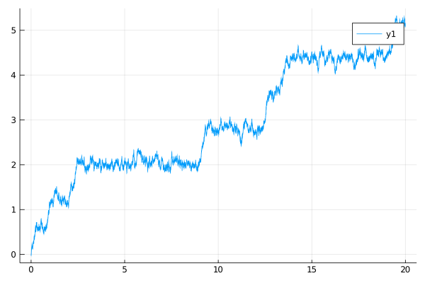
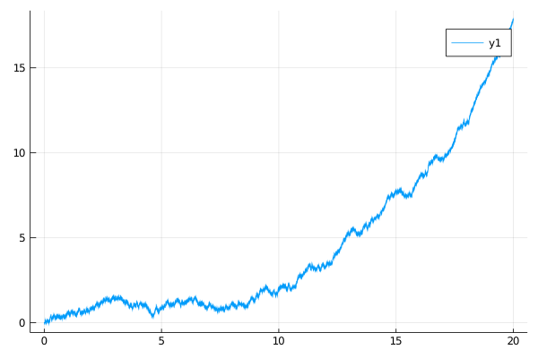

# Sine diffusion
A simple, scalar diffusion process displaying multimodality on a path space. It solves the following stochastic differential equation
```math
\dd X_t = (a + b\sin(c X_t))\dd t + \sigma \dd W_t,\quad t\in[0,T],\quad X_0=x_0.
```
It can be called with
```julia
@load_diffusion :Sine
```

#### Example
```julia
@load_diffusion Sine
θ = [1.0, 2.0, 8.0, 0.5]
P = Sine(θ...)
tt, y1 = 0.0:0.001:20.0, 0.0
X = rand(P, tt, y1)
plot(X)
```


### Auxiliary diffusion
We define an additional, linear diffusion that can be used in the setting of **guided proposals**. It solves the following SDE
```math
\dd \widetilde{X}_t = \left(\frac{x_T-x_0}{T} + \frac{t}{5T}\widetilde{X}_t\right)\dd t + \sigma \dd W_t,\quad t\in[0,T],\quad X_0=x_0,
```
and can be called with
```julia
@load_diffusion :SineAux
```
#### Example
```julia
@load_diffusion SineAux
θ = [1.0, 2.0, 8.0, 0.5]
t, T, y1, vT = 0.0, 20.0, 0.0, 4.0
P = SineAux(θ..., t, T, y1, vT)
tt = t:0.001:T
X = rand(P, tt, y1)
plot(X)
```

