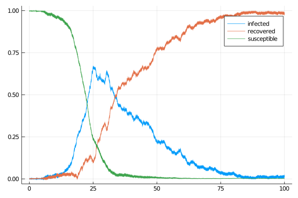
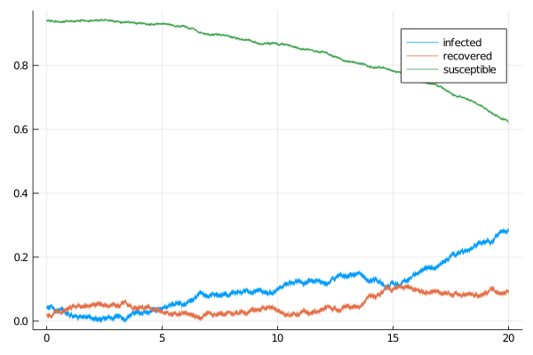

# Susceptible-Infectious-Recovered model
A simple, scalar-valued susceptible-infectious-recovered (SIR) model defined
by a two-dimension diffusion process solving the following SDE
```math
\begin{align*}
\dd I_t &= (\alpha (1-I_t-R_t)I_t - \beta I_t)\dd t -\sigma_1\sqrt{(1-I_t-R_t)I_t} \dd W^{(1)}_t - \sigma_2\sqrt{I_t}\dd W^{(2)}_t,\\
\dd R_t &= \beta I_t + \sigma_2\sqrt{I_t} \dd W^{(2)}_t,
\end{align*}
```
with $I_t\in[0,1]$ and $R_t\in[0,1]$ for all $t\in[0,T]$. It can be called with:
```julia
@load_diffusion SIR
```
#### Example
```julia
using DiffusionDefinition
using StaticArrays, Plots

@load_diffusion SIR
θ = [0.37, 0.05, 0.03, 0.03]
P = SIR(θ...)
tt, y1 = 0.0:0.001:100.0, @SVector [0.001, 0.001]
X = rand(P, tt, y1)
plot(X, Val(:vs_time), label=["infected" "recovered"])
plot!(X.t, map(x->1.0-x[1]-x[2], X.x), label="susceptible")
```


### Auxiliary diffusion
We additionally define a suitable linear process that can be used in the setting of **guided proposals**. It is a solution to the following SDE
```math
\begin{align*}
\dd \widetilde{I}_t &= (\alpha (1-\widetilde{I}_t-\widetilde{R}_t)\widetilde{I}_t - \beta \widetilde{I}_t)\dd t -\sigma_1(1-\widetilde{I}_t-\widetilde{R}_t)\widetilde{I}_t \dd W^{(1)}_t - \sigma_2\widetilde{I}_t\dd W^{(2)}_t,\\
\dd \widetilde{R}_t &= \beta \widetilde{I}_t + \sigma_2\widetilde{I}_t \dd W^{(2)}_t,
\end{align*}
```
and can be called with
```julia
@load_diffusion SIRAux
```

#### Example
```julia
using DiffusionDefinition
using StaticArrays, Plots

@load_diffusion SIRAux
θ = [0.37, 0.05, 0.03, 0.03]
t, T, vT = 0.0, 5.0, @SVector [0.5, 0.1]
P = SIRAux(θ..., t, T, vT)
tt, y1 = t:0.001:T, @SVector [0.04, 0.02]
X = rand(P, tt, y1)
plot(X, Val(:vs_time), label=["infected" "recovered"])
plot!(X.t, map(x->1.0-x[1]-x[2], X.x), label="susceptible")
```

