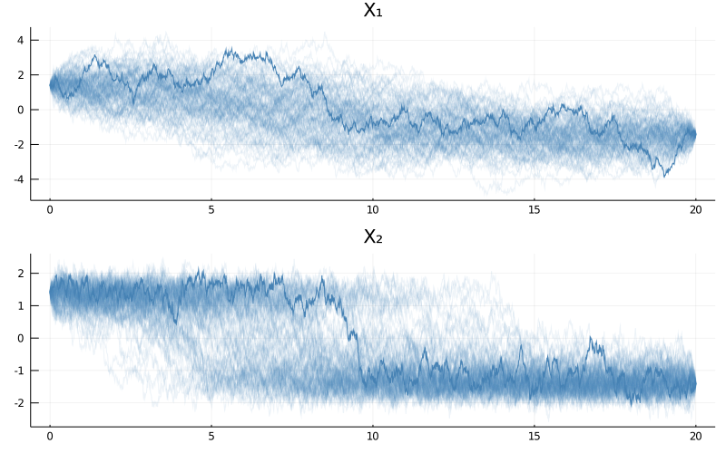
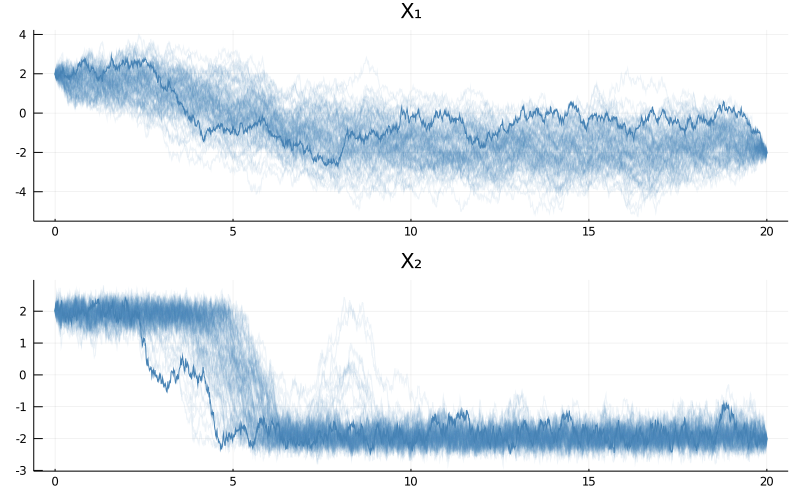

# [Sampling of diffusion bridges](@id tutorial_sampling_diff_bridges)
****
> In this tutorial we will illustrate how to sample diffusion bridges using rejection sampling and importance sampling with Brownian bridge proposals. We will also embed the latter routine in a Metropolis–Hastings algorithm. We will illustrate the techniques on the example of a bivariate double-well potential.

!!! warning
    Sampling of diffusion bridges using rejection sampling or importance sampling with Brownian bridge proposals **is—in general—not an efficient method and for plenitude of problems it is not even applicable**. It is, however, an excellent starting point for learning about simulation of conditioned diffusions. The tutorial is meant as a didactic explanation of the common mechanisms behind most samplers of conditioned diffusions. Nevertheless, it is NOT meant to be used for production purposes. For that we refer the user to [GuidedProposals.jl](https://juliadiffusionbayes.github.io/GuidedProposals.jl/dev/), which has been designed to specifically address the problem of sampling conditioned diffusions.

## Why is there so much text in this tutorial?
---
Sampling of diffusion bridges might seem like an innocent problem if you haven't seen it before. It is however a considerable obstacle that many mathematicians, statisticians and physicists have been attacking for tens of years. And for good reasons—efficient methods that solve this problem are considered to be extremely valuable tools for a variety of real-world applications. No universal solution has been found, however, there are a few contending methodologies that perform particularly well across a variety of problems of this kind. Many of those techniques are far too complicated to be explained in a single tutorial. Fortunately, simple versions of rejection and importance sampling fit the bill just right. Even these however require from us to cover some additional details. Hence the length of the tutorial.

## Rejection sampling
----
Rejection sampling is a simple, but extremely powerful technique for obtaining independent samples from some probability law $\mathbb{P}$ (with density $\dd \mathbb{P}$) using independent samples from another probability law $\mathbb{Q}$ (with density $\dd \mathbb{Q}$). You may, for instance, check out the [wikipedia article](https://en.wikipedia.org/wiki/Rejection_sampling) to learn more.

The basic algorithm is as follows:
```julia
struct RejectionSampling end
# these need to be appropriately defined
function density(P, at=x) ... end
function some_max_bound_on_dP_over_dQ(P, Q) ... end
P, Q = ...

function Base.rand(P, Q, ::RejectionSampling)
    M = some_max_bound_on_dP_over_dQ(P, Q)
    while true
        X° = rand(Q) # proposal
        acceptance_prob = density(P, at=X) / (density(Q, at=X) * M)
        # accept/reject; if reject then re-sample and retry; if accept then return X°
        if rand() <= acceptance_prob
            return X°
        end
    end
end
```
A sample returned by the algorithm above:
```julia
X = rand(P, Q, RejectionSampling())
```

is distributed exactly according to $\mathbb{P}$ even though all sampling was done exclusively through the law $\mathbb{Q}$.

!!! tip "Definition"
    The law $\mathbb{P}$ is called the **target** law, whereas $\mathbb{Q}$ is called the **proposal** law.

## Rejection sampling on a path space
---
Rejection sampling on a path space is a fancy name for the algorithm above as applied to diffusion processes, i.e. when the laws $\mathbb{P}$ and $\mathbb{Q}$ are some diffusion laws.

Computation of each individual term in the **acceptance probability**
```julia
acceptance_prob = density(P, at=X) / (density(Q, at=X) * M)
```
which in a mathematical notation becomes:
```math
\begin{equation}\label{eq:accpprobrs}
\frac{1}{M}\frac{\dd \mathbb{P}}{\dd \mathbb{Q}}(X)
\end{equation}
```
is not possible when working with diffusion processes. Nevertheless, the overall term can sometimes be found.


!!! note "Some mathematical details"
    In particular, let's assume that the target diffusion law is of the following form:
    ```math
    \begin{equation}\label{eq:target_rejection}
    \dd X_t = α(X_t)\dd t + \dd W_t,\quad X_0=x_0, \quad t\in[0,T],
    \end{equation}
    ```
    with $α:\RR^d→\RR^d$ (at least once continuously differentiable), a volatility coefficient given by the identity matrix and $W$ denoting a $d$-dimensional Brownian motion. Additionally, let's assume that there exists a function $A:\RR^d→\RR$ such that:
    ```math
    ∇A(x) = α(x).
    ```
    (We refer to $A$ as a **potential** function). Then, if we let $\mathbb{P}$ denote the law of \eqref{eq:target_rejection} conditioned on an end-point, i.e. of:
    ```math
    \dd X_t = α(X_t)\dd t + \dd W_t,\quad X_0=x_0,\quad X_T=x_T, \quad t\in[0,T],
    ```
    and we let $\mathbb{Q}$ denote the law of a $d$–dimensional Brownian bridge joining $x_0$ and $x_T$ on $[0,T]$, then the **Radon–Nikodym derivative** between the two is proportional to:
    ```math
    \begin{equation}\label{eq:rnd}
    \frac{\dd \mathbb{P}}{\dd \mathbb{Q}}(X)\propto \exp\left\{- \int_0^Tϕ(X_t)\dd t \right\}\leq 1,
    \end{equation}
    ```
    where
    ```math
    \begin{equation}\label{eq:phi_function}
    \phi(x):=\frac{1}{2}\left[ \alpha'\alpha + Δ A \right](x) - l.
    \end{equation}
    ```
    and $l$ is any constant, which we may take in particular to be
    ```math
    l\leq \inf_{x\in\RR^d}\left\{ \frac{1}{2}\left[ \alpha'\alpha + Δ A \right](x) \right\},
    ```
    that guarantee the inequality $\leq 1$ in \eqref{eq:rnd} and where the infimum on the right is **assumed to exist** (if it does not, then rejection sampling with Brownian bridge proposals cannot be applied).

The main take-away message from the box above is that if the stochastic differential equation admits a nice enough expression \eqref{eq:target_rejection}, then it is possible to find a closed form formula for the computation of the acceptance probability
```math
\frac{1}{M}\frac{\dd \mathbb{P}}{\dd \mathbb{Q}}(X),
```
and rejection sampling on a path space can be performed by simply repeatedly drawing from $\mathbb{Q}$–the law of Brownian bridges ([see this how-to-guide](@ref how_to_guides) for more info)—and accepting the samples with probability given in \eqref{eq:rnd}.

!!! note "Lamperti transformation"
    The restriction to identity matrix volatility coefficient may be slightly relaxed thanks to existence of Lamperti transformation, which allows one to transform a diffusion with a non-identity volatility coefficient to the one with identity volatility. This transform is applicable to all scalar diffusions, however, in multiple dimensions it is more restrictive. See [Ait Sahalia 2008] for more details.

### Example

Let's look at a simple example of a bivariate double-well potential model solving the following SDE
```math
\dd X_t = -\frac{1}{2}∇A(X_t)\dd t + \dd W_t,\quad X_0 = x_0,\quad t\in[0,T],
```
where
```math
A(x) := ρ_1\left[ (x_2)^2 - μ_1 \right]^2 + ρ_2\left[ x_2 - μ_2 x_1 \right]^2,
```
and $ρ_1,ρ_2,μ_1,μ_2>0$ are parameters. We can define it very simply

```julia
using DiffusionDefinition
const DD = DiffusionDefinition

using StaticArrays, LinearAlgebra

@diffusion_process BivariateDoubleWell{T} begin
    :dimensions
    process --> 2
    wiener --> 2

    :parameters
    (ρ1, ρ2, μ1, μ2) --> T

    :additional
    constdiff --> true
end

DD.b(t, x, P::BivariateDoubleWell) = @SVector [
    P.μ2*P.ρ2*(x[2]-P.μ2*x[1]),
    2.0*P.ρ1*P.μ1*x[2] - 2.0*P.ρ1*x[2]^3 - P.ρ2*(x[2]-P.μ2*x[1]),
]

@inline DD.σ(t, x, P::BivariateDoubleWell) = SDiagonal{2,Float64}(I)
```
!!! note
    In fact, below, we will never use the volatility coefficient. We defined it simply for completeness.

Tedious calculations reveal that function $ϕ$ achieves a global minimum:
```math
\inf_xϕ(x)= -\frac{p_1+p_2}{54μ_2^2(1+μ_2^2)},
```
where
```math
\begin{align*}
p_1&:=2μ_2\sqrt{2ρ_1}\left[ 9 + μ_2^2\left(9+2ρ_1μ_1^2\right) \right]^{3/2}\\
p_2&:=μ_2^2\left[ 54ρ_1μ_1(1+μ_2^2) - 8ρ_1^2μ_1^3μ_2^2 + 27ρ_2(1+μ_2^2)^2 \right].
\end{align*}
```
In Julia this becomes
```julia
function inf_ϕ(P::BivariateDoubleWell)
    -( compute_p1(P) + compute_p2(P) )/( 54.0*P.μ2^2*(1.0 + P.μ2^2) )
end

function compute_p1(P::BivariateDoubleWell)
    2.0*P.μ2*sqrt(2.0*P.ρ1)*(
        9.0 + P.μ2^2*(9.0 + 2.0*P.ρ1*P.μ1^2)
    )^(3/2)
end

function compute_p2(P::BivariateDoubleWell)
    P.μ2^2*(
        54.0*P.ρ1*P.μ1*(1.0+P.μ2^2)
        - 8.0*P.ρ1^2*P.μ1^3*P.μ2^2
        + 27*P.ρ2*(1.0+P.μ2^2)^2
    )
end
```
We should also have a routine for evaluating the $ϕ$ function:
```julia
function ϕ(x, P::DD.DiffusionProcess)
    b = DD.b(nothing, x, P)
    0.5*(dot(b,b) + sum(b_prime(x, P)))
end

b_prime(x, P::BivariateDoubleWell) = @SVector [
    -P.μ2^2*P.ρ2,
    2.0*P.ρ1*P.μ1 - 6.0*P.ρ1*x[2]^2 - P.ρ2,
]
```
As well as for computing the acceptance probability for the simulated proposal path:
```julia
function acc_prob(X, P::DD.DiffusionProcess, l=inf_ϕ(P))
    logprob = 0.0
    for i in 1:length(X)-1
        dt = X.t[i+1]-X.t[i]
        logprob -= (ϕ(X.x[i], P) - l)*dt
    end
    exp(logprob)
end
```
Finally, we want to have a routine for sampling from the proposal law, which in our case is the law of Brownian bridges (see [the relevant how-to-guide](@ref how_to_guides) for more details).
```julia
using Random
struct BrownianBridge end

function Random.rand!(::BrownianBridge, X, x0=zero(X.x[1]), xT=zero(X.x[1]))
    rand!(Wiener(), X)
    T, B_T = X.t[end], X.x[end]
    λ(t, x) = ( x0 + x + (xT - x0 - B_T) * t/T )
    X.x .= λ.(X.t, X.x)
end
```
We are now ready to implement rejection sampling on a path space.

```julia
function Base.rand(P::DD.DiffusionProcess, tt, x0, xT, ::RejectionSampling)
    X° = trajectory(tt, P).process
    # compute constant l only once, it won't change anyway
    l = inf_ϕ(P)
    while true
        # proposal draw
        rand!(BrownianBridge(), X°, x0, xT)

        # accept/reject; if reject then re-sample and retry; if accept then return X°
        (rand() <= acc_prob(X°, P, l)) && return X°
    end
end
```

That's it! As you can see for yourself: a beautifully simple algorithm. Let's test it. We will be using the following parameterization
```julia
θ = (
    ρ1 = 0.5,
    ρ2 = 0.5,
    μ1 = 2.0,
    μ2 = 1.0
)
```

The bivariate double-well potential is—as the name suggests it–a diffusion with a stationary distribution that has two modes. These modes are at:
```julia
mode1 = @SVector [sqrt(θ.μ1)/θ.μ2, sqrt(θ.μ1)]
mode2 = @SVector [-sqrt(θ.μ1)/θ.μ2,-sqrt(θ.μ1)]
```

Consequently, when we simulate the trajectory over long intervals we should observe the trajectories being attracted to these two poles.

Let's start modestly and try to simulate $30$ bridge trajectories over the interval $[0,3]$ that join the two diffusion modes
```julia
P = BivariateDoubleWell(θ...)
tt = 0.0:0.01:3.0

N = 30
paths = [rand(P, tt, mode1, mode2, RejectionSampling()) for i in 1:N]

using Plots
p = plot(size=(800, 500), layout=(2,1))
for i in 1:N
    plot!(p, paths[i], Val(:vs_time), alpha=[0.2 0.2], color=["steelblue" "steelblue"], label=["X₁" "X₂"])
end
display(p)
```


When you run the code above you might be slightly surprised because of two reasons.
1. First, where is the bimodality behavior we talked about?
2. Second, why did the code not execute immediately? Seemingly there aren't that many computations to be performed! On my computer it takes around 1.5second to simulate the trajectories. Why so long?

To answer the first concern, the bimodal behavior becomes pronounced only over long enough time-spans. The time span we used was simply too short and the trajectories ended-up being stretched around a straight line that connects the end-points. Had we taken longer time-spans the behavior would have been more pronounced. But let's not jump ahead of ourselves by trying to run the algorithm above with larger $T$. Indeed, the reason for the slow performance of the code above is that an already seemingly short time-span of $[0,3]$ is troublesome for the sampler and **most proposals end up being rejected**. We can modify the routine a little to examine the magnitude of the problem

```julia
function Base.rand(P::DD.DiffusionProcess, tt, x0, xT, ::RejectionSampling)
    X° = trajectory(tt, P).process
    # compute constant l only once, it won't change anyway
    l = inf_ϕ(P)
    num_prop = 0
    while true
        # proposal draw
        rand!(BrownianBridge(), X°, x0, xT)
        num_prop += 1

        # accept/reject; if reject then re-sample and retry; if accept then return X°
        (rand() <= acc_prob(X°, P, l)) && (
            println("Proposed $num_prop trajectories until acceptance");
            return X°;
        )
    end
end
```
And let's see what is the ballpark figure for the number of proposals until acceptance:
```julia
[rand(P, tt, mode1, mode2, RejectionSampling()) for i in 1:5]
Proposed 4168 trajectories until acceptance
Proposed 762 trajectories until acceptance
Proposed 1939 trajectories until acceptance
Proposed 4816 trajectories until acceptance
Proposed 14576 trajectories until acceptance
```
Thousands of proposals for a single accepted path! That's not very efficient...

You might be thinking to yourself *how bad could it get if we try to increase $T$ nevertheless*? It turns out **exponentially** bad. For instance:
```julia
julia> tt = 0.0:0.01:4.0
0.0:0.01:4.0

julia> paths = [rand(P, tt, mode1, mode2, RejectionSampling()) for i in 1:5]
Proposed 274113 trajectories until acceptance
Proposed 22926 trajectories until acceptance
Proposed 8498 trajectories until acceptance
Proposed 258171 trajectories until acceptance
Proposed 216711 trajectories until acceptance
```
Hundreds of thousands of proposals for a single acceptance... If you are about to grab a cup of coffee you can also run the following:
```julia
julia> tt = 0.0:0.01:5.0
0.0:0.01:5.0

julia> paths = [rand(P, tt, mode1, mode2, RejectionSampling()) for i in 1:5]
Proposed 82423 trajectories until acceptance
Proposed 4279263 trajectories until acceptance
Proposed 1524125 trajectories until acceptance
Proposed 5512559 trajectories until acceptance
Proposed 3745595 trajectories until acceptance
```
Millions of proposals until acceptance... Trying larger $T$s is probably not advisable here unless you are going away for a holiday.

!!! note
    On the plus side, the bimodality is slowly revealing itself:
    ```julia
    using Plots
    N = 5
    p = plot(size=(800, 500), layout=(2,1), title=["X₁" "X₂"])
    for i in 1:N
        plot!(p, paths[i], Val(:vs_time), alpha=[0.5+0.8*(i==N) 0.5+0.5*(i==N)], color=["steelblue" "steelblue"], label="")
    end
    display(p)
    ```
    

This is all to say that rejection sampling is not suitable for sampling **long diffusion bridges**. On the other hand, we should appreciate what we have achieved. We have sampled **independent** and identically distributed trajectories from the law of a bivariate double-well potential diffusion bridge! And we did it by sampling **exclusively from the law of Brownian bridges**. This is nothing to be taken for granted and it is an impressive result in itself. Nevertheless, we can still do better, even within the scope of this tutorial.

## Importance Sampling on a path space
----
Importance sampling can be thought of as a modification to rejection sampling, where the accept/reject step is substituted with decorating each sample with a weight. To be more precise, the term that was used as an acceptance probability is now used as a weight and is returned together with a sample. The algorithm becomes:

```julia
struct ImportanceSampling end

function Base.rand(P::DD.DiffusionProcess, tt, x0, xT, ::ImportanceSampling)
    X° = trajectory(tt, P).process
    # constant l no longer needs to be computed as all weights contain it
    l = 0.0 # was `inf_ϕ(P)`

    rand!(BrownianBridge(), X°, x0, xT)

    return X°, acc_prob(X°, P, l)
end
```

The first advantage of importance sampling is that we only need to know weights up to a constant of proportionality (in particular, we don't need to know $M$ from \eqref{eq:accpprobrs}, or $l$ from \eqref{eq:phi_function}). In particular for diffusions, we don't even need to know the potential function $A$. This relaxation of technical conditions makes it possible to apply importance sampling to diffusion laws that couldn't have been sampled with rejection sampling. It doesn't however help with the computational cost. True, the accept/reject step is no longer there, so it only takes one execution of the routine to yield an output, however, most of these samples are going to have very low weights attached to them, meaning that they won't be of much use (though they will still have some use, as opposed to the samples rejected by the rejection sampler). For instance:
```julia
tt = 0.0:0.01:3.0
weights = [rand(P, tt, mode1, mode2, ImportanceSampling())[2] for i in 1:Int(1e4)]
histogram(weights./sum(weights), norm=true, label="distribution of normalized weights")
```

while
```julia
julia> round.(sort(weights)[end-9:end]./sum(weights), sigdigits=3)
10-element Array{Float64,1}:
 0.0021
 0.00213
 0.00214
 0.00223
 0.00224
 0.00232
 0.00236
 0.00323
 0.00372
 0.00382
```

Computation of expectations of path functionals might however be better behaved.

## Independence sampler on a path space
---
The next algorithm on our list of improvements is an independence sampler. By itself it doesn't strike as being particularly beneficial–at most it seems to afford a change of perspective–but it will become an important stepping stone to more efficient algorithms.

Independence sampler is a particular, simple type of Metropolis–Hastings algorithm. Samples are repeatedly generated **independently** (hence the name) according to some proposal density $X^\circ\sim d\mathbb{Q}$ and each proposal draw is either accepted with probability
```math
a(X,X^\circ):= 1∧\frac{
    \frac{d\mathbb{P}}{d\mathbb{Q}}(X^\circ)
}{
    \frac{d\mathbb{P}}{d\mathbb{Q}}(X)
}
```
or is otherwise rejected. In case of acceptance we set $X←X^\circ$, whereas otherwise, we simply reject $X^\circ$ and leave $X$ unchanged. The output of the algorithm is a chain of accepted $X$s, whose stationary distribution will be given by $\mathbb{P}$.

You can think of this Metropolis–Hastings algorithm as a stack of importance samplers that use computed weights
```math
w(X)\propto\frac{d\mathbb{P}}{d\mathbb{Q}}(X)
```
to evaluate the acceptance probability for the accept/reject step. In Julia we can write:
```julia
struct IndependenceSampler end

function Base.rand(P::DD.DiffusionProcess, tt, x0, xT, num_iter, ::IndependenceSampler)
    X = trajectory(tt, P).process
    X° = deepcopy(X)
    rand!(BrownianBridge(), X, x0, xT)
    w = acc_prob(X, P, 0.0) # weight

    num_accpt = 0
    for i in 1:num_iter
        # sample proposal
        rand!(BrownianBridge(), X°, x0, xT)
        # compute its weight
        w° = acc_prob(X°, P, 0.0)

        # Metropolis–Hastings step
        if rand() <= w°/w # note that l (no matter its value) cancels out
            X, X° = X°, X
            w = w°
            num_accpt += 1
        end
    end
    println("accpt rate: ", num_accpt/num_iter)

    return X
end

rand(P, tt, mode1, mode2, 1e4, IndependenceSampler())
```
where we've added some message about acceptance rate. It's a useful metric for practice.

Independence sampler does not address the issue of the computational issues that we had before as the proposals are still sampled blindly from the Wiener law. However, it takes us right to the front door of some algorithms that do.

## Metropolis–Hastings algorithm with local updates
----
The power of the Metropolis–Hastings algorithm comes from the fact that we don't need to make independent updates and we may instead use local updates that exploit the fact that an already accepted path must have been somewhat good for it to be accepted. In particular, for the diffusion laws we can use a technique called preconditioned Crank–Nicolson scheme to–instead of sample diffusion paths independently from the Brownian bridge laws–perturb the already accepted paths locally. The mathematical details are beyond the scope of this tutorial (though they are not complicated and you might be able to figure them out from looking at the code below), but the preconditioned Crank–Nicolson scheme (with an additional step of non-centered parameterization) can be implemented as follows:
```julia
function noncenter_and_crank_nicolson!(X°, X, ρ)
    # "non-centered parameterization"
    rev_x° = zero_out_Brownian_birdge!(X°)
    rev_x = zero_out_Brownian_birdge!(X)

    # local move
    crank_nicolson!(X°.x, X.x, ρ)

    # transform back to regular parameterization
    rev_x°(X°)
    rev_x(X)
end

# transforms x0-xT Brownian bridges to 0-0 Brownian bridges
# and returns a transformation that can do the reverse
function zero_out_Brownian_birdge!(X)
    T, x0, xT = X.t[end], X.x[1], X.x[end]
    λ(t, x) = ( x - x0 - (xT - x0)*t/T )
    X.x .= λ.(X.t, X.x)
    λ_rev(t, x) = ( x0 + x + (xT - x0) * t/T )
    reversal!(x) = (x.x .= λ_rev.(x.t, x.x))
    reversal!
end

# perturbs the path y locally in the direction given by y°, saves to y°
function crank_nicolson!(y°, y, ρ)
    λ = sqrt(1-ρ^2)
    y° .= λ .* y° .+ ρ .* y
end
```

With this scheme we can run a Metropolis–Hastings algorithm with local updates of trajectories

```julia
struct MetropolisHastings end

function Base.rand(P::DD.DiffusionProcess, tt, x0, xT, num_iter, ::MetropolisHastings; ρ=0.0, save_every=100)
    X = trajectory(tt, P).process
    X° = deepcopy(X)
    rand!(BrownianBridge(), X, x0, xT)
    w = acc_prob(X, P, 0.0) # weight

    paths = []
    num_accpt = 0
    for i in 1:num_iter
        # sample proposal
        rand!(BrownianBridge(), X°, x0, xT)
        # but move it only a little by perturbing X
        noncenter_and_crank_nicolson!(X°, X, ρ)
        # compute its weight
        w° = acc_prob(X°, P, 0.0)

        # Metropolis–Hastings step
        if rand() <= w°/w # note that l (no matter its value) cancels
            X, X° = X°, X
            w = w°
            num_accpt += 1
        end

        # save an accepted path once in a while
        (i % save_every == 0) && push!(paths, deepcopy(X))
    end
    println("acceptance rate: ", num_accpt/num_iter)

    return paths
end
```

Parameter $ρ\in[0,1)$ is called a memory parameter of the preconditioned Crank–Nicolson scheme. It indicates how much the sampling of new trajectories relies on the previously accepted path ($ρ=0$ indicating independence sampler and $ρ=1$ a degenerate sampler that does not move at all, because it is bound to the previously accepted path forever).

On one hand, when we set $ρ$ to higher values, then sampling becomes easier (acceptance rate increases), on the other hand we don't move much and we need to make many more steps. You might worry that in a haste of improving computational cost due to length of bridges by increasing $ρ$ we might be falling from the frying pan into the fire and trade one source of computational burden for the exact amount of another. This however is not the case, as the cost due to length of bridges is exponential, whereas that due to $ρ$ scales much better.

To see it for yourself, let's try to sample bridges over a much longer time span, say $[0,20]$. It would probably take years to sample a single bridge of this length (for our example) using rejection sampling on a path space. But it is possible with the Metropolis–Hastings algorithm with local moves on a path space.

```julia
P = BivariateDoubleWell(θ...)

tt = 0.0:0.01:20.0
paths = rand(P, tt, mode1, mode2, 1e5, MetropolisHastings(), ρ=0.997, save_every=1000)

p = plot(size=(800, 500), layout=(2,1), title=["X₁" "X₂"])
for i in eachindex(paths)
    a = (i == length(paths))
    plot!(p, paths[i], Val(:vs_time), alpha=[0.1+a 0.1+a], color=["steelblue" "steelblue"], label="")
end
display(p)
```


As you can see the bimodality is now much more pronounced. We can even observe it more strongly if we consider a harder problem of different parameterization for which modes have a greater separation.

```julia
θ = (
    ρ1 = 0.5,
    ρ2 = 0.5,
    μ1 = 4.0,
    μ2 = 1.0
)
mode1 = @SVector [sqrt(θ.μ1)/θ.μ2, sqrt(θ.μ1)]
mode2 = @SVector [-sqrt(θ.μ1)/θ.μ2,-sqrt(θ.μ1)]

P = BivariateDoubleWell(θ...)

tt = 0.0:0.01:20.0
paths = rand(P, tt, mode1, mode2, 1e5, MetropolisHastings(), ρ=0.999, save_every=1000)

p = plot(size=(800, 500), layout=(2,1), title=["X₁" "X₂"])
for i in eachindex(paths)
    a = 0.9*(i == length(paths))
    plot!(p, paths[i], Val(:vs_time), alpha=[0.1+a 0.1+a], color=["steelblue" "steelblue"], label="")
end
display(p)
```


However, before calling it a victory let's run the algorithm again and see what happens:
```julia
paths = rand(P, tt, mode1, mode2, 1e5, MetropolisHastings(), ρ=0.999, save_every=1000)

p = plot(size=(800, 500), layout=(2,1), title=["X₁" "X₂"])
for i in eachindex(paths)
    a = 0.9*(i == length(paths))
    plot!(p, paths[i], Val(:vs_time), alpha=[0.1+a 0.1+a], color=["steelblue" "steelblue"], label="")
end
display(p)
```


The paths look quite different! It appears that $1e5$ is not enough steps to fully explore the stationary distribution for this example and a much greater number of steps will be needed. Diagnosing whether your chain has converged or not is part science, part experience, (and sometimes) part art.

## Concluding remarks
----
TODO


!!! tip "Exercise"
    Modify rejection sampling on a path space for a bivariate double well potential with a diagonal volatility coefficient with diagonal entries $σ_1$ and $σ_2$.
